# RouteProof

**Verifiable proof-of-handoff for logistics on Stellar Soroban.**

[](https://github.com/anyhonyde123-glitch/RouteProof/actions/workflows/ci.yml)
[](https://web-sandy-one-51.vercel.app)
[](docs/TESTNET.md)
[](LICENSE)

RouteProof is a production-style logistics custody dApp: organizations register roles, create shipments, record cryptographically verifiable handoffs, run inspections, and settle delivery — all on Soroban with a multi-wallet Next.js frontend.

**Live demo:** https://web-sandy-one-51.vercel.app  
**Repo:** https://github.com/anyhonyde123-glitch/RouteProof  
**Demo video:** [routeproof.mp4](https://drive.google.com/file/d/1bl_BypwaDtdBeGOcGQcDIgXiFUWeHZWf/view?usp=sharing)

<p align="center">
  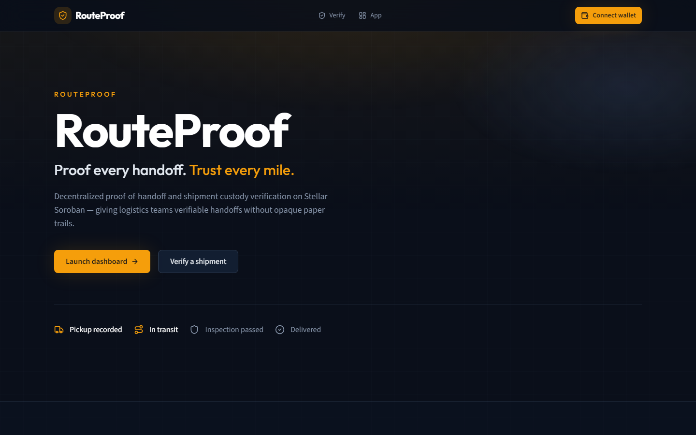
</p>

---

## Table of contents

- [Problem & solution](#problem--solution)
- [Architecture](#architecture)
- [State machine](#state-machine)
- [Protocol sequence](#protocol-sequence)
- [Repository layout](#repository-layout)
- [Features](#features)
- [Screenshots](#screenshots)
- [Testnet deployment](#testnet-deployment)
- [Setup](#setup)
- [CI/CD](#cicd)
- [Testing](#testing)
- [Demo workflow](#demo-workflow)
- [Orange Belt checklist](#orange-belt-checklist)
- [Known limitations](#known-limitations)
- [License](#license)

---

## Problem & solution

| Pain | RouteProof fix |
| --- | --- |
| Custody disputes live in email / spreadsheets | Immutable on-chain handoff timeline |
| No shared “who held it when” record | Role-gated actors + stage proofs |
| Opaque ERP trails | Public `/verify` page (no wallet required) |
| Fragile demo contracts | Six cooperating Soroban contracts + CI |

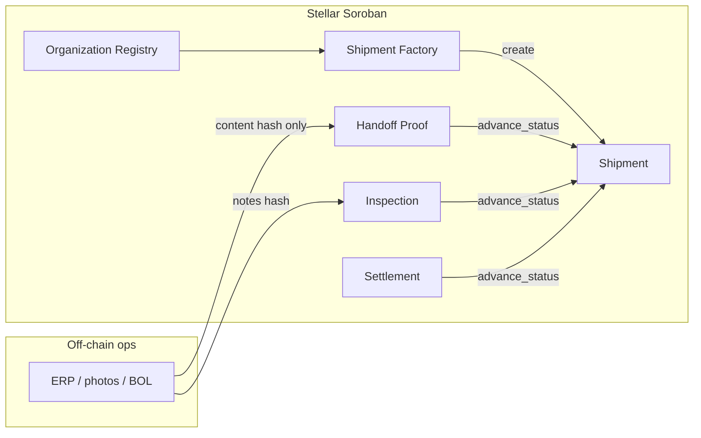

---

## Architecture

Six contracts cooperate via **contract-to-contract** `env.invoke_contract` calls (no sibling crates linked into WASM).

| Contract | Responsibility |
| --- | --- |
| `organization-registry` | Org registration, role bitmasks, verification |
| `shipment-factory` | Role-gated shipment creation entrypoint |
| `shipment` | Lifecycle, participants, status machine |
| `handoff-proof` | Custody handoffs + duplicate stage prevention |
| `inspection` | Approve / reject with notes hash |
| `settlement` | Delivered → Completed |

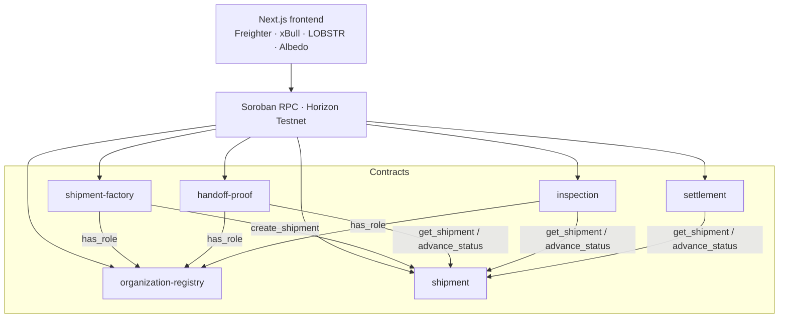

Roles (bitmask): `Sender=1` · `Carrier=2` · `Warehouse=4` · `Inspector=8` · `Receiver=16`

Deep dive: [`docs/ARCHITECTURE.md`](docs/ARCHITECTURE.md)

---

## State machine

Invalid transitions, unauthorized actors, duplicate handoffs, and double settlement are rejected on-chain.

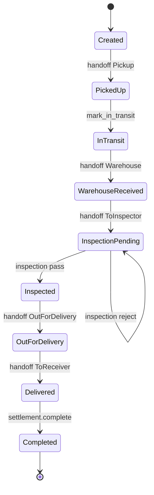

---

## Protocol sequence

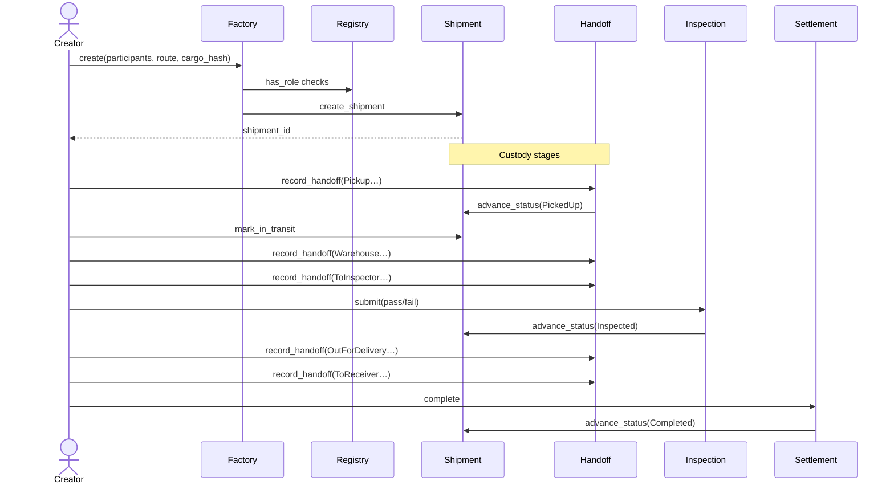

---

## Repository layout

```text
routeproof/
├── contracts/                  # Six Soroban crates
│   ├── organization-registry/
│   ├── shipment-factory/
│   ├── shipment/
│   ├── handoff-proof/
│   ├── inspection/
│   └── settlement/
├── packages/integration-tests/ # End-to-end protocol tests
├── apps/web/                   # Next.js 15 + TypeScript + Tailwind
├── scripts/                    # Build + Testnet deploy + screenshots
├── docs/
│   ├── ARCHITECTURE.md
│   ├── TESTNET.md
│   └── screenshots/
└── .github/workflows/ci.yml
```

---

## Features

- **Advanced Soroban logic** — auth, roles, state machine, C2C composition
- **Multi-wallet** — Freighter, xBull, LOBSTR, Albedo
- **Live UI refresh** — dashboard / shipments / detail poll on-chain reads
- **Public verify** — `/verify/[id]` without connecting a wallet
- **Humanized errors** — contract-code aware messaging + toast UX
- **CI/CD** — fmt, clippy, unit + integration tests, WASM build, frontend lint/typecheck/test/build
- **Mobile responsive** — app shell + landing + verify

---

## Screenshots

### Desktop

| Landing | Dashboard |
| --- | --- |
|  | 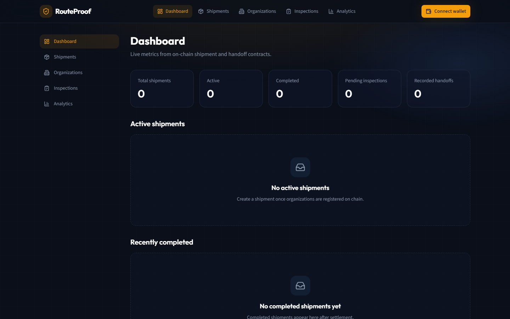 |

| Shipments | Public verify |
| --- | --- |
| 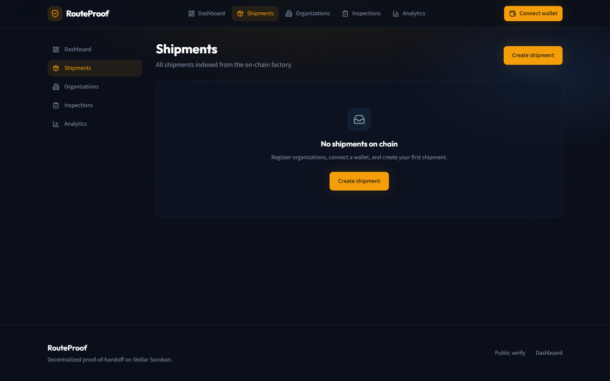 | 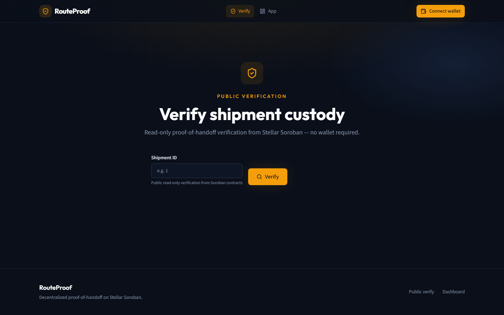 |

### Multi-wallet picker

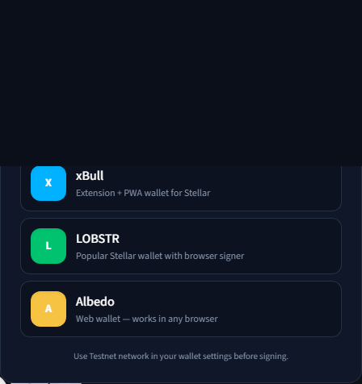

### Mobile responsive

| Landing (390×844) | Dashboard mobile | Verify mobile |
| --- | --- | --- |
| 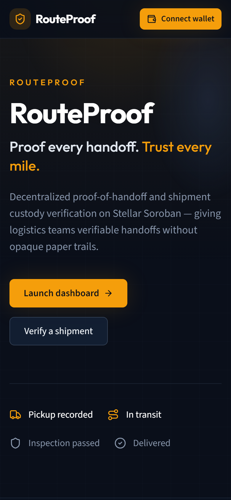 | 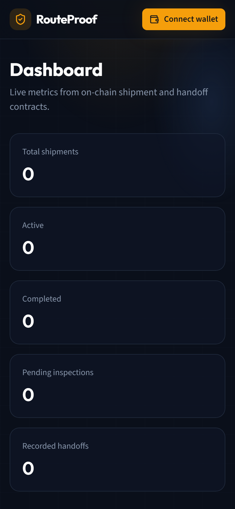 | 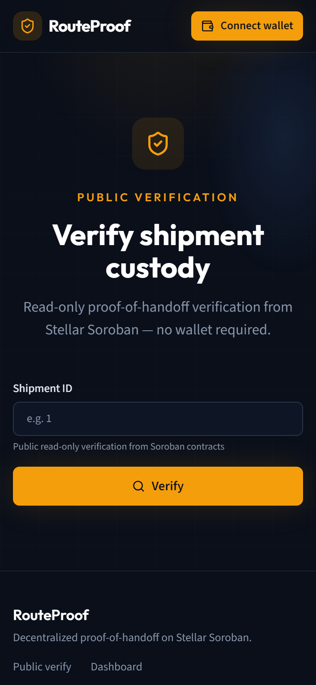 |

### CI/CD & tests

| GitHub Actions | Vitest (36 passed) |
| --- | --- |
| 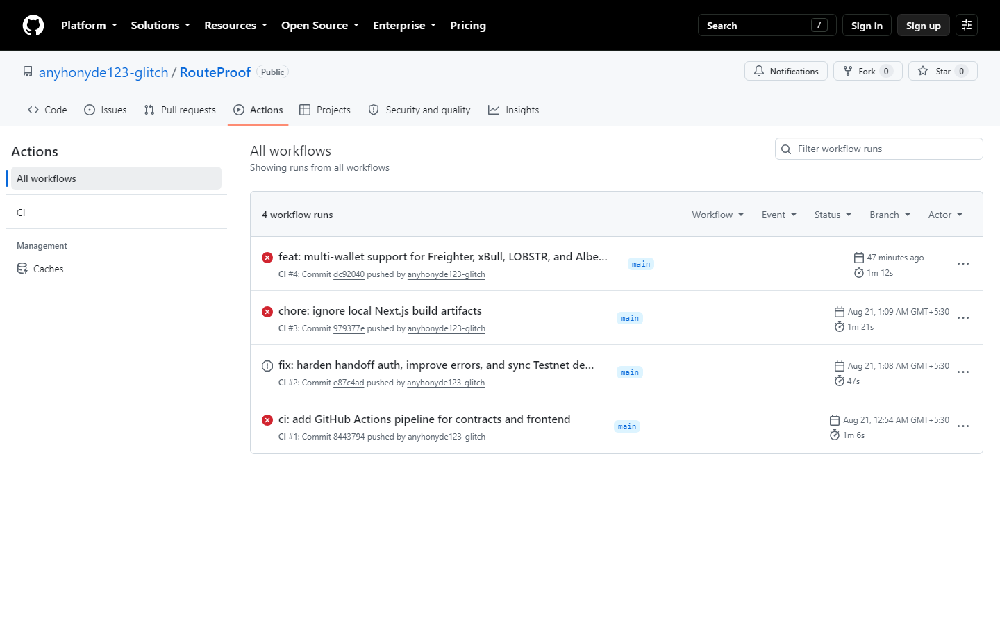 | 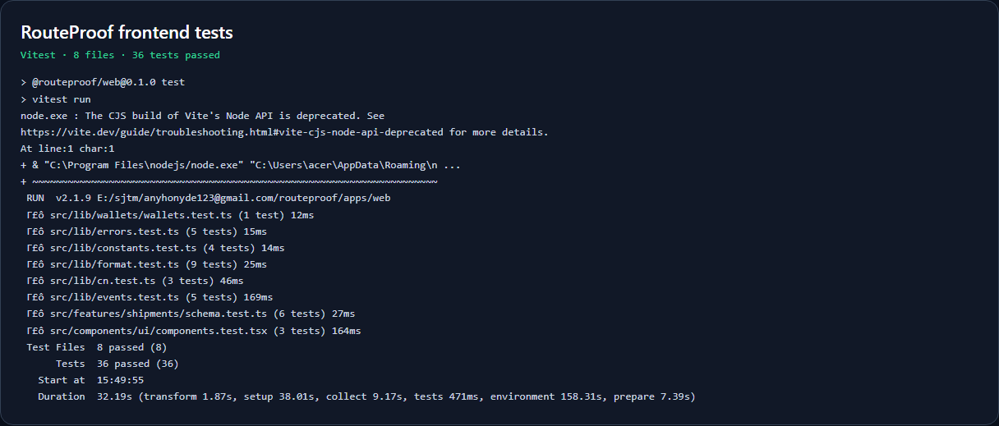 |

---

## Testnet deployment

Network: **Testnet** · Passphrase: `Test SDF Network ; September 2015`  
Admin / deployer: `GC5VBHY5DWV7NTL4PCQL3XGOE4FY2DJHM2JYLRC6YS2IHYTPDZ4DOFIU`

| Contract | Address |
| --- | --- |
| Registry | `CBEXUO3HHZPXW53ASP7YVSPKHE2VJ22ZSIDUKEWWYOSOQNC6VRSE6GG3` |
| Shipment | `CASDW56YOVZVLKGG6XOK5S7YZS6VUQCJ6TA24OE22NP2SKFIDSSACYCH` |
| Factory | `CAB4GA22LSWQ3SMEWLCTQLYVQNG36MPCZIT4Z4OREGHBCZJK57ZUK22L` |
| Handoff | `CC6GQZELGLUQTL3LD3QQ4ZGDQH5DHRLHXRWTXA5EGZWWPDI3FDKK4P2W` |
| Inspection | `CDKYWMFYXYRS5YLPEWMTILU26ZFSC66L2BHINVWWZQB5GYGIOIOKLKYA` |
| Settlement | `CCNK2HTS7OVGMA32HP6JVSMIWMB4XSX2OHKUA45FLRWZWV2HPGF7KIA7` |

### Real transaction hashes

| Step | Tx hash |
| --- | --- |
| Deploy registry | [`8b9aea54…73d0`](https://stellar.expert/explorer/testnet/tx/8b9aea54f4c918dcb7d0244daa4aa76ea42aa8fd43564d1a1c8aa5e8e86d73d0) |
| Deploy shipment | [`c3292ea3…86de`](https://stellar.expert/explorer/testnet/tx/c3292ea339899418d0b5154f56570ae85f976fdde79b196af057e99f2b8286de) |
| Deploy factory | [`d8e8da0c…4f73`](https://stellar.expert/explorer/testnet/tx/d8e8da0c9a82b6b9804826dd2b614780cc84f46212eef50557f0207a38c34f73) |
| Register org (interaction) | [`4cdac45a…81e4`](https://stellar.expert/explorer/testnet/tx/4cdac45aa84b8c7cab36b1cf4bd818971267a5115e89909b18479820d3b381e4) |

Full table: [`docs/TESTNET.md`](docs/TESTNET.md)

---

## Setup

### Prerequisites

- Rust stable + `wasm32v1-none`
- [Stellar CLI](https://developers.stellar.org/docs/tools/cli) v25+
- Node.js 22+
- Freighter / xBull / LOBSTR / Albedo (Testnet)

```bash
rustup target add wasm32v1-none
```

### Smart contracts

```bash
cargo fmt --all -- --check
cargo test -p organization-registry -p shipment -p shipment-factory \
  -p handoff-proof -p inspection -p settlement --lib
cargo test -p routeproof-integration-tests
stellar contract build
```

### Frontend

```bash
cd apps/web
cp .env.example .env.local   # fill contract IDs from deploy
npm install
npm run dev
```

### Testnet deploy (Windows)

```powershell
stellar keys generate deployer --network testnet --fund   # once
.\scripts\deploy-testnet.ps1
Copy-Item apps\web\.env.local.generated apps\web\.env.local
```

---

## CI/CD

GitHub Actions (`.github/workflows/ci.yml`) on every push/PR to `main`:

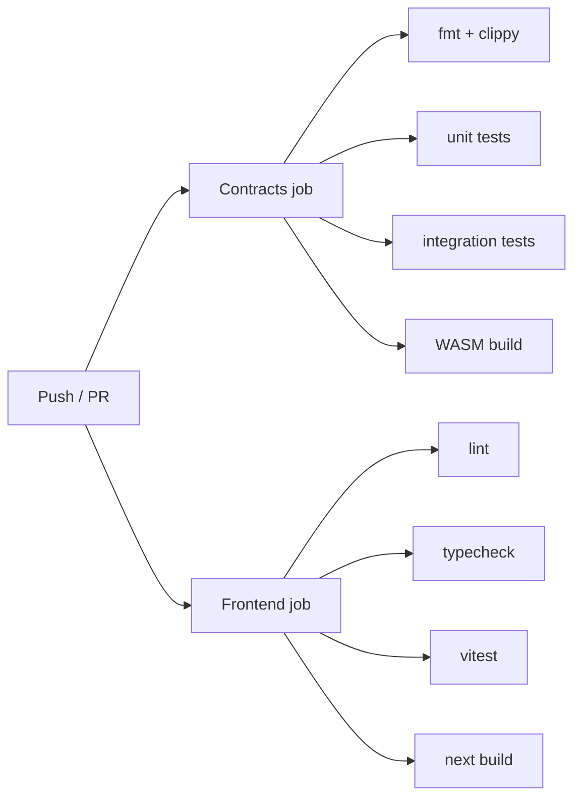

---

## Testing

| Layer | Command | Coverage |
| --- | --- | --- |
| Contract unit | `cargo test -p … --lib` | Registry, shipment, factory, handoff, inspection, settlement |
| Protocol E2E | `cargo test -p routeproof-integration-tests` | Full happy path + reject/retry |
| Frontend | `cd apps/web && npm test` | **36** Vitest cases (validation, UI, events, wallets, errors) |

---

## Demo workflow

1. Open https://web-sandy-one-51.vercel.app  
2. **Connect wallet** → Freighter / xBull / LOBSTR / Albedo (Testnet)  
3. Register organizations / roles (admin wallet)  
4. Create a shipment with five participants  
5. Record Pickup → Transit → Warehouse → Inspection → Delivery  
6. Settle completion  
7. Open `/verify/[id]` for the public custody timeline  

**Demo video (1–2 min):** [routeproof.mp4 on Google Drive](https://drive.google.com/file/d/1bl_BypwaDtdBeGOcGQcDIgXiFUWeHZWf/view?usp=sharing)

---

## Orange Belt checklist

| Requirement | Status |
| --- | --- |
| Public GitHub repo | ✅ |
| README + docs | ✅ |
| 10+ meaningful commits | ✅ (20+) |
| Live demo (Vercel) | ✅ https://web-sandy-one-51.vercel.app |
| Contract addresses | ✅ |
| Interaction tx hash | ✅ |
| Mobile UI screenshots | ✅ |
| CI/CD screenshots | ✅ |
| Test output (3+ tests) | ✅ 36 passed |
| Demo video 1–2 min | ✅ [Drive link](https://drive.google.com/file/d/1bl_BypwaDtdBeGOcGQcDIgXiFUWeHZWf/view?usp=sharing) |
| Advanced contracts + C2C | ✅ |
| Events + live refresh | ✅ |
| Error/loading states | ✅ |
| Multi-wallet | ✅ |

**Submission package is complete** — use August Challenge on the platform with the GitHub repo, Vercel URL, contract IDs / tx hashes from this README, screenshots under `docs/screenshots/`, and the demo video link above.

---

## Known limitations

- Proof payloads are content hashes (blobs stay off-chain)
- No dedicated event indexer yet (client reads + live refresh)
- Registry org registration is admin-gated on current Testnet deploy

## Roadmap (Green Belt)

- QR-based public verify  
- Indexer + analytics warehouse  
- 10+ real logistics users  
- Mainnet hardening  

---

## License

Apache-2.0
