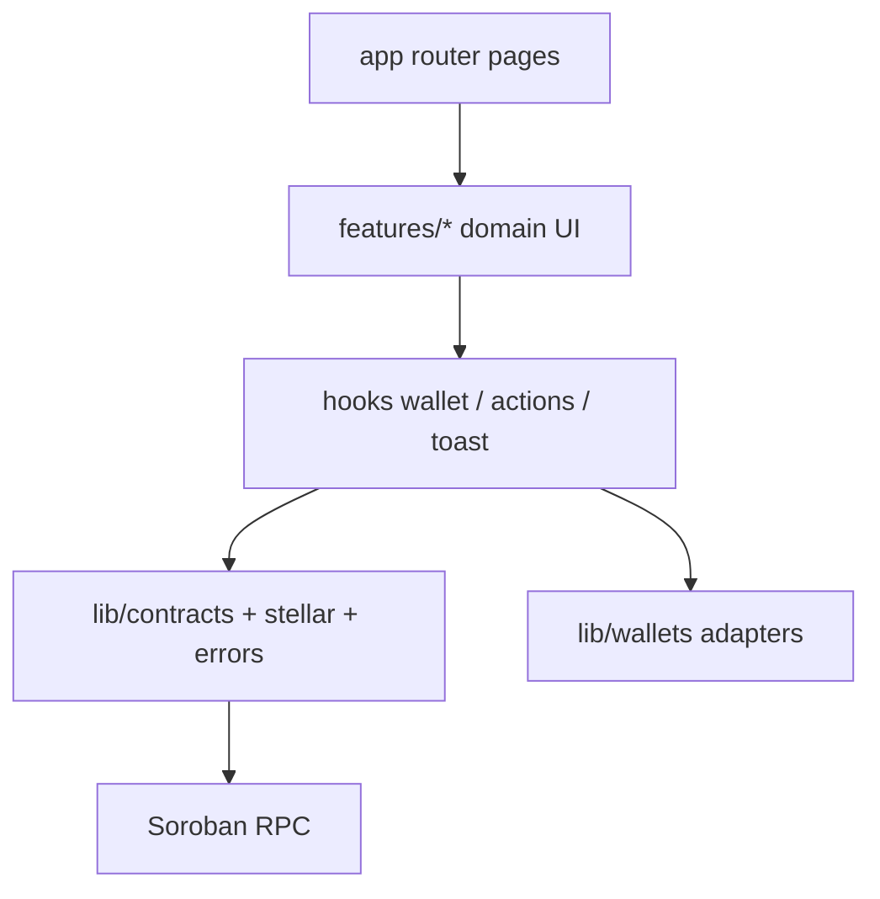

# Architecture

RouteProof is a multi-contract Soroban protocol for logistics custody with a Next.js client.

## Design goals

1. **Separation of concerns** — registry, factory, shipment core, handoff, inspection, settlement
2. **Hard auth** — every mutating path requires the correct actor + role / participant check
3. **Safe composition** — C2C via `env.invoke_contract` (no sibling WASM linkage)
4. **Verifiability** — public reads for shipment + timeline without wallet

## Authorization matrix

| Action | Auth |
| --- | --- |
| register org | registry admin |
| create shipment | creator + factory role checks |
| mark in transit | shipment carrier |
| record handoff | actor matching stage parties + roles |
| submit inspection | shipment inspector |
| settle | receiver (or admin) |
| advance_status | handoff / inspection / settlement contracts only |

## Storage

- **Instance:** config, admin, counters  
- **Persistent:** orgs, shipments, handoffs, inspections, settlements  
- **TTL:** extended on write  

## Frontend layers

- UI components (presentational)
- Features (domain screens)
- Hooks (wallet / actions / toast / live refresh)
- `lib/contracts` + `lib/stellar` (blockchain I/O)
- `lib/wallets` (Freighter, xBull, LOBSTR, Albedo)
- `lib/errors` (humanized failures)

## Events

Contracts publish typed events (`shipment_created`, `status_changed`, `handoff_recorded`, inspection / settlement events).  
The UI rebuilds a custody timeline from contract getters and **live-refreshes** Server Components every ~12s.
